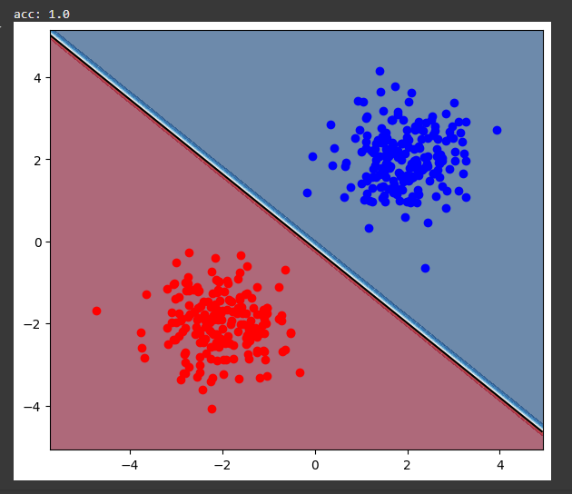

# Machine Learning Linear SVM


**A professional and educational Linear SVM implementation from scratch in Python.** Trained with **Stochastic Gradient Descent (SGD)** using **hinge loss**, and supports **Platt Scaling** for probability estimation. Perfect for learning, experimentation, and rapid prototyping of SVM classifiers.

---

## 📸 Demo Screenshot

Below is an example visualization of the decision boundary and class probabilities generated by the classifier.


<br>
*Blue points → class +1, Red points → class -1, White/Black line → decision boundary.*

---

## 🚀 Features

* Pure **NumPy implementation**, no external ML libraries required
* **SGD-based optimization** for hinge loss
* Optional **intercept/bias term** handling
* **Platt Scaling** for calibrated probabilities
* Predict classes and probabilities
* Visualize **decision boundaries** and **class distributions**

---

## 📂 Project Structure

```
├── svm.py                 # Main implementation (LinSvm class)
├── README.md              # Project documentation
├── requirements.txt       # Dependencies
└── demo_screenshot.png # Example output screenshot
```

---

## 🔧 Installation

Clone the repository and install dependencies:

```bash
git clone https://github.com/Behdad-kanaani/machine-learning-linear-svm.git
cd machine-learning-linear-svm
pip install -r requirements.txt
```

**requirements.txt**:

```
numpy
matplotlib
```

---

## 📊 Usage Example

Run the demo to train the classifier on synthetic data and visualize results:

```bash
python svm.py
```

Expected output:

```
acc: 1
```

---

## 📖 Python Code Example

```python
from svm import LinSvm
import numpy as np

# Sample dataset
X = np.array([[2,2], [3,3], [-2,-2], [-3,-3]])
y = np.array([1, 1, -1, -1])

# Train classifier
clf = LinSvm(C=1.0, lr=0.05, epochs=100, bsize=32)
clf.fit(X, y)
clf.fitplatt(X, y)

# Predictions
print(clf.predict([[0,0], [2,2]]))
print(clf.proba([[0,0], [2,2]]))
```

---

## 📈 Visualization Notes

* Blue points → class **+1**
* Red points → class **-1**
* Black line → decision boundary
* Contour shows **probability of positive class**

---

## 🤝 Contributing

Pull requests are welcome! Please open an issue for major changes before submitting.

---

## 📜 License

This project is licensed under the **AGPL v3 License**.

---

### ⭐ Support

If you find this repository useful, please give it a star on [GitHub](https://github.com/Behdad-kanaani)!
